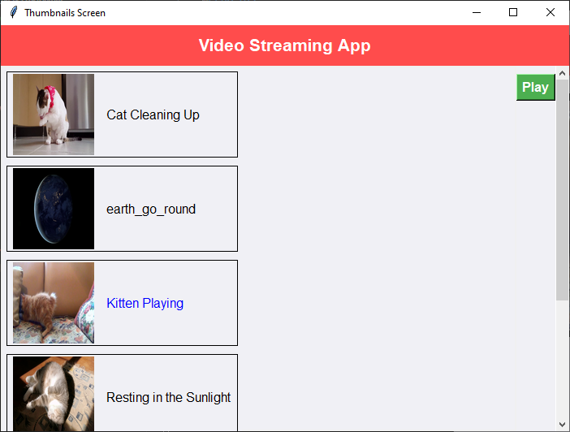
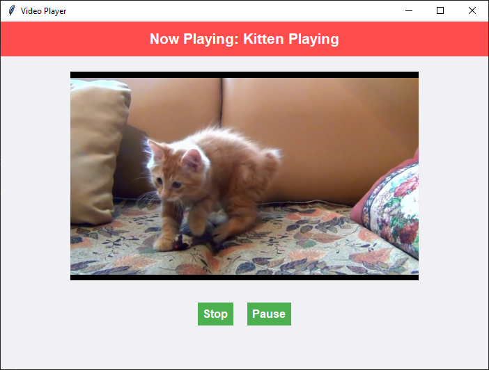
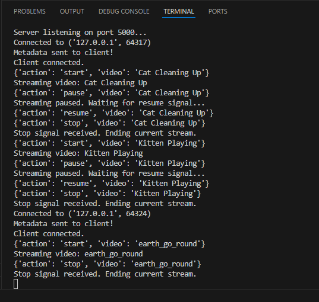

# Real-Time Video Streaming with Interactive Client Interface

## Overview

This project implements a real-time video streaming system using a TCP connection. The server streams videos stored locally to clients, while the client application provides an interactive GUI for video selection and playback. The system uses Python and integrates libraries like OpenCV for video handling and Tkinter for the GUI.

## Features

- **Server-Side Functionality:**

  - Dynamically detects videos in a `videos` directory.
  - Generates and manages thumbnails for each video.
  - Streams video frames to clients via TCP.
  - Handles control signals (play, pause, stop, and resume) from clients.

- **Client-Side Functionality:**

  - Displays video thumbnails and titles in an interactive GUI.
  - Allows users to select and play videos.
  - Implements video playback controls (play, pause, stop, resume).

## Prerequisites

- Python 3.8+
- Libraries:
  - OpenCV
  - Tkinter
  - PIL (Pillow)
  - NumPy

## Directory Structure

```
project/
├── src/
│   ├── server.py
│   ├── client.py
├── videos/
│   ├── [video files]
├── thumbnails/
    ├── [generated thumbnails]
```

## Setup

### 1. Clone the Repository

```bash
git clone <repository_url>
cd project/src
```

### 2. Install Dependencies

Ensure you have the required libraries installed. Use the following command:

```bash
pip install opencv-python-headless pillow numpy
```

### 3. Directory Setup

- Place video files in the `videos` directory.
- Ensure a `thumbnails` directory exists at the same level as `src`.

## Usage

### 1. Start the Server

Run the server script to begin listening for client connections:

```bash
python server.py
```

### 2. Start the Client

Run the client script to launch the GUI:

```bash
python client.py
```

## How It Works

### Server

1. **Initialization:**
   - Detects videos in the `videos` directory.
   - Generates thumbnails for each video and stores metadata in `metadata.json`.
2. **Metadata Transmission:**
   - Sends video metadata (titles and thumbnails) to clients upon connection.
3. **Video Streaming:**
   - Streams video frames dynamically based on client requests.
   - Handles client control signals to manage playback states.

### Client

1. **GUI Creation:**
   - Displays a thumbnail screen with video titles.
   - Provides a separate playback screen with controls for play, pause, stop, and resume.
2. **Video Selection:**
   - Sends control signals to the server based on user actions.
3. **Video Playback:**
   - Receives video frames from the server and displays them in the GUI.

## Screenshots

### Video Selection Window
The thumbnail screen where users can browse and select videos.



### Video Player Window
The playback screen with controls for play, pause, stop, and resume.



### Server Terminal Logs
The server logs control signals received from the client.



## Highlights

- **Threaded Architecture:**

  - The server uses multithreading to handle multiple clients and maintain smooth video streaming.
  - The client uses threads to separate video streaming from GUI operations.

- **Dynamic Metadata Management:**

  - The server dynamically generates and updates metadata, ensuring a seamless experience.

- **Responsive GUI:**

  - The client GUI is designed for user-friendliness with clear navigation and interactive features.

## Notes

- Ensure all video files are in formats supported by OpenCV (e.g., `.mp4`, `.avi`, `.mkv`).
- Thumbnails are generated only for videos present in the `videos` directory.

## Contributing

Contributions are welcome! Please fork the repository and create a pull request for any enhancements or bug fixes.
